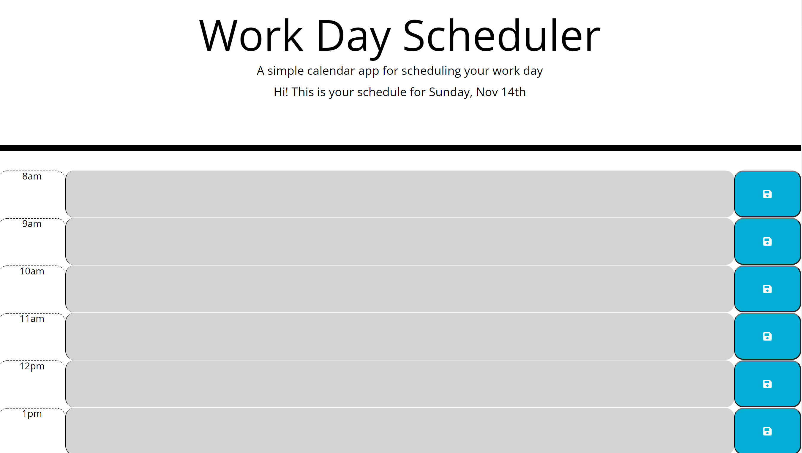

## Shaun's Daily Planner

## About
A simple app that uses JQuery to produce a basic planner.

## Purpose
To build a daily planner that displays the business hours and saved tasks for the current day. Practice JavaScript and JQuery as well as utilizing localstorage.

## Built With
* HTML
* CSS
* JavaScript
* JQuery

## Live Application Link
https://mnshaun24.github.io/make-a-date-daily-planner/

## Screenshot

## Contribution
Shaun Sticka
